```mermaid
graph TD;
    A["Features"]-->AB["Main Page"];
    A["Features"]-->AC["Onboarding Page"];
    A["Features"]-->AD["Setting Page"];
    A["Features"]-->AA["Database"];

    AB["Main Page"]-->ABA["Note"];
    AB["Main Page"]-->ABB["Chat"];
    AC["Onboarding Page"]-->AAAB["Authentication"];
    AD["Setting Page"]-->AAAB["Authentication"];
    AA["Database"]-->AAA["Supabase"];
    
    ABA["Note"]-->ABAB["UX"];
    ABA["Note"]-->ABAA["UI"];
    ABA["Note"]-->ABAC["CRUD"];
    ABB["Chat"]-->ABBA["Assistant"];
    ABB["Chat"]-->ABBB["Commands"];
    ABB["Chat"]-.->ABBC["Image & File Uploading"];
    AAA["Supabase"]-->AAAB["Authentication"];
    AAA["Supabase"]-->AAAA["Storage"];
    AAA["Supabase"]-->AAAC["Security"];

    AAAB["Authentication"]-->AAABAA["Google Auth"];
    AAAC["Security"]-->AAACA["RLS"];
    ABAA["UI"]-->ABAAA["Editor"];
    ABAB["UX"]-->ABACC["Markdown"];
    ABAB["UX"]-->ABACA["Syncing"];
    ABAB["UX"]-->ABACB["Date Indicator"];
    ABAC["CRUD"]-->ABAAA["Editor"];
    ABBA["Assistant"]-->ABBAA["RAG"];
    ABBA["Assistant"]-->ABBAB["LLM"];
    ABBA["Assistant"]-->ABBAC["UI"];
    ABBA["Assistant"]-->ABBAD["UX"];
    ABBA["Assistant"]-.->ABBAE["Summarize Notes"];
    ABBB["Commands"]-->ABBBA["/open"];
    ABBB["Commands"]-.->ABBBB["/filter"];
    
    ABAAA["Editor"]-->ABAAAA["Update"];
    ABAAA["Editor"]-->ABAAAB["Delete"];
    ABBAA["RAG"]-->ABBAAA["Hybrid Search"];
    ABBAB["LLM"]-->ABBABA["OpenAI API"];
    ABBAB["LLM"]-.->ABBABB["Other LLM"];
    ABBAB["LLM"]-.->ABBABC["User API Keys"];
    ABBAC["UI"]-.->ABBACA["User Instruction"];
    ABBAD["UX"]-->ABBADA["Knowledge Base"];

    ABBAAA["Hybrid Search"]-->ABBAAAA["Text Search"];
    ABBAAA["Hybrid Search"]-->ABBAAAB["Sementic Search"];

    style A stroke:#000000;

    classDef red stroke:#ff4c4c,stroke-width:2px;
    classDef orange stroke:#ffa500,stroke-width:2px;
    classDef yellow stroke:#ffd700,stroke-width:2px;
    classDef blue stroke:#4682B4,stroke-width:2px;
    classDef uncompleted stroke-dasharray: 5 5;

    class AA,AB,AC,AD,AAA,ABA,ABB,AAAA,AAAB,AAAC,ABAA,ABAB,ABAC,ABBA,AAAAA,AAACA,ABAAA,ABACA,ABBAA,ABBAB,ABAAAA,ABAAAB,ABBAAA,ABBABA,ABBAAAA,ABBAAAB,AAABAA,ABACC,ABBAC,ABBAD red;
    class ABBABB,ABBABC,ABBACA,ABBC,ABBACA,ABBADA,ABBAE orange;
    class ABBB,ABBBA,ABBBB,ABACB yellow;
    class ABBBB,ABBABB,ABBABC,ABBC,ABBACA,ABBAE uncompleted;
```

### Summary:
- **Red (stroke:#FF4C4C,stroke-width:2px)** → Must-Have
- **Orange (stroke:#FFA500,stroke-width:2px)** → Should-Have
- **Yellow (stroke:#FFD700,stroke-width:2px)** → Could-Have
- **Blue (stroke:#4682B4,stroke-width:2px)** → Won’t-Have (for now)
- **Dashed lines (`-.->`)** → Planned but not implemented connections
- **Dashed borders (`stroke-dasharray: 5 5`)** → Unimplemented features